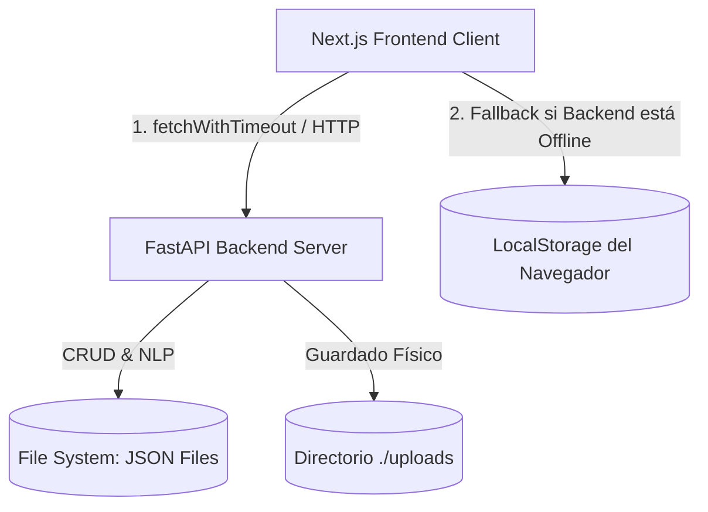

# Manual de Arquitectura y Guía para Agentes de IA - NeuroSoft

Este documento describe de manera exhaustiva la arquitectura real de **NeuroSoft**, el flujo de datos, las responsabilidades de sus directorios, las convenciones de desarrollo y las reglas esenciales para que los agentes de IA interactúen y modifiquen esta base de código sin romper la funcionalidad existente.

> [!IMPORTANT]
> **Fuente de verdad**: La información contenida en este archivo se basa directamente en la inspección del código fuente del repositorio. Ante discrepancias entre la documentación general (como el `README.md` principal o el `backend/README-Back.md`) y la implementación de los archivos, **el código es la única fuente de verdad**.

---

## 1. Arquitectura del Sistema

NeuroSoft utiliza una arquitectura desacoplada estructurada en dos componentes principales: un frontend en Next.js (App Router) y un backend en FastAPI. La persistencia de datos posee una característica particular de tolerancia a fallos.



### 1.1. Persistencia y Almacenamiento
* **Backend**: Persiste los registros directamente en archivos JSON estructurados en el sistema de archivos del servidor (`./backend/data/pacientes/` y `./backend/data/historias/`). Los archivos originales de las historias clínicas se almacenan en `./backend/uploads/`.
* **Diferencias Críticas con los READMEs**: 
  1. El archivo `docker-compose.yml`, los comentarios del código, `requirements.txt` (que incluye `sqlalchemy`) y sobre todo el archivo `backend/README-Back.md` mencionan el uso de una base de datos relacional SQLite (`neurosoft.db`), modelos SQLAlchemy en `app/models/models.py` y scripts de migración (`migrar_db.py`, `factory.py`, `limpiar_db.py`). **Ninguno de estos archivos ni directorios de base de datos relacional existe en el repositorio real. La persistencia es puramente basada en archivos JSON**.
  2. El archivo `backend/README-Back.md` menciona el uso de `pywin32` en Windows para leer archivos `.doc` antiguos. Sin embargo, el código real de la aplicación en [extract_text.py](file:///home/ulieet/Documentos/paginasweb/NeuroSoft/backend/app/utils/extract_text.py) ejecuta la herramienta Unix `antiword` mediante la biblioteca estándar `subprocess`, manejando manualmente la decodificación para evitar fallos.

### 1.2. Arquitectura de Integración Híbrida (Dual-Mode / Fallback)
El frontend implementa una arquitectura altamente tolerante a fallos de red:
* Hace solicitudes al backend mediante una función utilitaria con límite de tiempo (`fetchWithTimeout`).
* Si el backend no responde, está apagado o responde con errores, el frontend ejecuta un **fallback transparente al almacenamiento local (LocalStorage)** a través de funciones implementadas en [almacen-datos.ts](file:///home/ulieet/Documentos/paginasweb/NeuroSoft/frontend/medical-system/lib/almacen-datos.ts).
* Esto permite que la aplicación frontend funcione al 100% de manera offline simulando la base de datos completa.

### 1.3. Lógica de Negocio y Procesamiento
* **Procesamiento NLP**: Se ha implementado un enfoque **híbrido con fallback**. 
  * En primera instancia, el servicio intenta conectarse con una instancia de **Ollama** local (`http://localhost:11434`) utilizando el modelo de lenguaje ligero **`qwen2.5:3b`** o similar (gratuito y offline) para extraer de forma inteligente y contextual la información estructurada en JSON.
  * Si la instancia de Ollama no responde, no está instalada, o falla la petición, el sistema ejecuta un **fallback automático y transparente hacia el motor de reglas determinista** basado en expresiones regulares precompiladas.
* **Cálculos, Filtrado y Agregación**: 
  * Las operaciones de ordenamiento, filtrado complejo de historias y el cálculo de la progresión de la enfermedad por paciente (EDSS, actividad RMN, brotes) se realizan **en el lado del cliente (Frontend)** utilizando lógica JS/TS (`useMemo` y lotes de llamadas) sobre las historias obtenidas, no en el backend.
  * El backend no implementa los endpoints de filtrado (`/historias/filtrar`), línea de tiempo (`/pacientes/{id}/linea-tiempo`) o análisis (`/pacientes/{id}/analisis`) sugeridos por el `README.md`. El frontend simula estos comportamientos localmente resolviendo múltiples peticiones a nivel de componente.

---

## 2. Módulos Principales

### 2.1. Backend (FastAPI)
* **API Routers (`app/api/`)**:
  * [importaciones.py](file:///home/ulieet/Documentos/paginasweb/NeuroSoft/backend/app/api/importaciones.py): Endpoint `/importaciones/historias` (POST). Permite subir archivos (.doc, .docx, .pdf), llama al servicio NLP para generar el borrador, verifica la existencia de registros duplicados calculando una clave hash (`dedup_key`), guarda el archivo físico en `./uploads` y persiste el borrador con estado `"pendiente_validacion"` en `./data/historias`.
  * [historias.py](file:///home/ulieet/Documentos/paginasweb/NeuroSoft/backend/app/api/historias.py): Gestiona las historias clínicas. Permite crearlas manualmente, listarlas, obtener borradores/historias completas, descargarlas en formato físico original, realizar la validación individual (`/historias/{id}/validacion` mediante PATCH) y realizar la validación masiva (`/historias/validacion-masiva` mediante POST).
  * [pacientes.py](file:///home/ulieet/Documentos/paginasweb/NeuroSoft/backend/app/api/pacientes.py): CRUD de pacientes. Al eliminar un paciente (`DELETE /pacientes/{id}`), realiza un **borrado en cascada** eliminando tanto el registro maestro del paciente como todos sus archivos de historia clínica asociados.
  * [reportes.py](file:///home/ulieet/Documentos/paginasweb/NeuroSoft/backend/app/api/reportes.py): Endpoint `/reportes/general` (GET) que devuelve las estadísticas globales agregadas de la cohorte de pacientes.
* **Services (`app/services/`)**:
  * [nlp_service.py](file:///home/ulieet/Documentos/paginasweb/NeuroSoft/backend/app/services/nlp_service.py): Pipeline principal de extracción basado en reglas. Limpia el texto crudo, divide el documento en secciones, y mediante expresiones regulares extrae: Nombre, DNI, Fecha de nacimiento, Obra social, Número de afiliado, Fecha de consulta, Diagnóstico (con código CIE-10 G35), Tratamientos (moléculas de DMT y fármacos de soporte, dosis, frecuencia, estado de inicio/suspensión), Resonancia Magnética (RMN), Punción Lumbar (LCR) y escala EDSS.
  * [patient_service.py](file:///home/ulieet/Documentos/paginasweb/NeuroSoft/backend/app/services/patient_service.py): Capa de persistencia para el maestro de pacientes. Escribe archivos JSON con el formato `{clean_dni}.json` en `./data/pacientes/`.
  * [report_service.py](file:///home/ulieet/Documentos/paginasweb/NeuroSoft/backend/app/services/report_service.py): Procesa todos los JSON de `./data/historias`, unifica los datos por el paciente (DNI), clasifica los tratamientos modificadores de la enfermedad (DMT) por nivel de eficacia, calcula la tasa anualizada de brotes (ARR), y determina el porcentaje NEDA-3 (No Evidence of Disease Activity: libre de brotes y de actividad en RMN).
* **Utilities (`app/utils/`)**:
  * [extract_text.py](file:///home/ulieet/Documentos/paginasweb/NeuroSoft/backend/app/utils/extract_text.py): Lector universal. Usa `pdfplumber` para PDFs, `python-docx` para archivos `.docx`, y la herramienta de consola `antiword` (vía `subprocess`) para archivos antiguos `.doc`.
  * [normalize.py](file:///home/ulieet/Documentos/paginasweb/NeuroSoft/backend/app/utils/normalize.py): Normaliza formatos de fechas, valores EDSS a coma flotante, nombres de meses y moléculas de tratamientos médicos.
  * [patterns.py](file:///home/ulieet/Documentos/paginasweb/NeuroSoft/backend/app/utils/patterns.py): Expresiones regulares precompiladas.

### 2.2. Frontend (Next.js)
* **Lib (`lib/`)**:
  * [almacen-datos.ts](file:///home/ulieet/Documentos/paginasweb/NeuroSoft/frontend/medical-system/lib/almacen-datos.ts): Código que contiene los tipos de datos principales (`Paciente`, `HistoriaClinica`, `Medicamento`, etc.) y la simulación completa del CRUD en el navegador usando `localStorage`.
  * [api-historias.ts](file:///home/ulieet/Documentos/paginasweb/NeuroSoft/frontend/medical-system/lib/api-historias.ts): Cliente API para el manejo de historias clínicas con lógica de timeout y recuperación offline de LocalStorage.
  * [api-pacientes.ts](file:///home/ulieet/Documentos/paginasweb/NeuroSoft/frontend/medical-system/lib/api-pacientes.ts): Cliente API para consultar y actualizar pacientes.
* **App Router (`app/`)**:
  * [app/page.tsx](file:///home/ulieet/Documentos/paginasweb/NeuroSoft/frontend/medical-system/app/page.tsx): Dashboard de inicio. Muestra recuentos de historias clínicas en tiempo real.
  * [app/pacientes/](file:///home/ulieet/Documentos/paginasweb/NeuroSoft/frontend/medical-system/app/pacientes/): CRUD y selector de pacientes.
  * [app/historias/](file:///home/ulieet/Documentos/paginasweb/NeuroSoft/frontend/medical-system/app/historias/): Gestión de historias, validación masiva, importación de documentos `.docx`/`.doc` y filtros avanzados dinámicos ejecutados en el cliente.
  * [app/analisis/](file:///home/ulieet/Documentos/paginasweb/NeuroSoft/frontend/medical-system/app/analisis/): Panel de Progresión de la Enfermedad. Carga las historias del paciente, resuelve cada borrador en lote y calcula en caliente la progresión de la escala EDSS, la recurrencia de brotes clínicos y los cambios en el tratamiento DMT.

---

## 3. Flujo de Datos

### 3.1. Proceso de Importación y Deduplicación
1. **Subida**: El usuario arrastra uno o varios archivos (.doc/.docx/.pdf) en el frontend.
2. **Control de Lotes y Rate Limit (Frontend)**: Si el usuario intenta subir más de 5 archivos en lote, el frontend muestra una confirmación advirtiendo sobre el tiempo estimado de procesamiento. Para respetar los límites del nivel gratuito de la API de NLP (15 peticiones por minuto), el frontend aplica una espera de **4.5 segundos** entre cada archivo antes de disparar la petición HTTP al servidor.
3. **Endpoint**: Se envía un payload multipart individual a `/importaciones/historias`.
4. **Parseo y NLP**:
   * El backend extrae el texto usando `extract_text.py`.
   * `nlp_service.process()` analiza el texto estructurando la información médica del paciente (intentando con Ollama primero y con fallback a expresiones regulares en caso de error o desconexión).
5. **Paciente Maestro**: Si el borrador extraído contiene un DNI válido, se invoca a `patient_service.upsert_paciente_from_nlp()`. Si el paciente ya existe en `./data/pacientes/{clean_dni}.json`, actualiza los campos vacíos. Si no, crea el archivo del paciente.
6. **Deduplicación**: Se genera la clave `dedup_key` concatenando: DNI + Fecha de consulta + hash corto del texto original. Si ya existe un JSON en `./data/historias/` con esa clave, el servidor borra el archivo temporal del directorio `./uploads` y retorna un error `409 Conflict`.
7. **Guardado**: Se escribe el borrador médico en `./data/historias/{timestamp}_{suffix}.json` con el estado inicial `"pendiente_validacion"`.

### 3.2. Proceso de Validación
1. **Frontend**: El usuario ingresa a la historia clínica en estado pendiente, edita la información extraída incorrectamente en el formulario y pulsa "Validar".
2. **Backend**: El cliente envía una petición `PATCH` a `/historias/{id_historia}/validacion` con los campos corregidos. El backend guarda la información en la clave `validada` del JSON y cambia su estado general a `"validada"`.

---

## 4. Responsabilidades de los Directorios

```
/
├── backend/                             # API de FastAPI y lógica NLP
│   ├── app/
│   │   ├── api/                         # Mapeo de enrutadores y controladores HTTP
│   │   ├── services/                    # Motores de negocio (NLP, Reportes, CRUD Maestro)
│   │   ├── utils/                       # Herramientas de formateo, regex y lectura física
│   │   ├── mock/                        # Respuestas predeterminadas estáticas
│   │   └── main.py                      # Punto de entrada de FastAPI
│   ├── data/                            # Directorio persistente de archivos JSON (Pacientes e Historias)
│   ├── uploads/                         # Directorio persistente de historias clínicas físicas subidas
│   ├── requirements.txt                 # Dependencias de Python
│   └── Dockerfile                       # Construcción e instalación de antiword en el backend
│
├── frontend/
│   └── medical-system/                  # Proyecto Next.js
│       ├── app/                         # Enrutamiento App Router de Next.js
│       ├── components/                  # Componentes y elementos visuales reutilizables
│       ├── hooks/                       # Custom react hooks para modularizar estados
│       ├── lib/                         # Clientes API y persistencia en LocalStorage
│       ├── public/                      # Recursos y datos JSON de ejemplo
│       ├── Dockerfile                   # Construcción e inicio del servidor de producción Next.js
│       └── package.json                 # Dependencias npm
│
├── docker-compose.yml                   # Orquestación de contenedores
└── Iniciar_NeuroSoft.bat                # Script de automatización de arranque local
```

---

## 5. Convenciones de Código

### 5.1. Backend (Python)
* **Formato**: Uso estricto de `snake_case` para variables y funciones.
* **Rutas**: Las rutas importadas de backend deben referenciar desde el módulo raíz `app` (ej: `from app.services import patient_service`).
* **Tratamiento de Errores**: Retornar excepciones `HTTPException` nativas de FastAPI indicando código de estado y detalle (ej: `raise HTTPException(status_code=404, detail="Historia no encontrada")`).

### 5.2. Frontend (TS / React)
* **Nombres de Archivos**: Componentes en PascalCase, helpers e interfaces en `kebab-case`. Las carpetas del App Router usan `kebab-case` o corchetes para rutas dinámicas (ej: `[id]`).
* **Tipado TS**: Las estructuras devueltas por los endpoints deben tiparse explícitamente utilizando las interfaces descritas en `almacen-datos.ts`.
* **Manejo de Red**: Al realizar consultas externas, utilizar bloques `try/catch` para capturar fallos de conexión y activar de inmediato la redirección o fallback a funciones locales de LocalStorage.

---

## 6. Guía de Desarrollo: Agregar Nuevas Funcionalidades

Para agregar un nuevo campo (por ejemplo, la presión arterial del paciente) o una nueva funcionalidad respetando la arquitectura:

1. **Definir la Interfaz (Frontend)**:
   * Modificar la interfaz `HistoriaClinica` en [almacen-datos.ts](file:///home/ulieet/Documentos/paginasweb/NeuroSoft/frontend/medical-system/lib/almacen-datos.ts) para agregar el campo opcional (ej: `presionArterial?: string`).
2. **Implementar en el Servicio NLP (Backend)**:
   * Agregar la expresión de búsqueda regex adecuada en [patterns.py](file:///home/ulieet/Documentos/paginasweb/NeuroSoft/backend/app/utils/patterns.py).
   * Añadir una función de extracción y normalización en [nlp_service.py](file:///home/ulieet/Documentos/paginasweb/NeuroSoft/backend/app/services/nlp_service.py).
   * Mapear el nuevo campo en la estructura de salida del diccionario `borrador` dentro de la función `process()`.
3. **Persistencia**:
   * Asegurar que el guardado manual del backend en [historias.py](file:///home/ulieet/Documentos/paginasweb/NeuroSoft/backend/app/api/historias.py) no filtre el campo. Como el backend guarda el diccionario completo en JSON mediante `json.dump()`, este cambio será automático si se envía desde el cliente.
4. **Vistas e Interfaz**:
   * Incorporar el campo en la interfaz gráfica de edición de historia clínica (`app/historias/editar/page.tsx`) y visualización de detalles (`app/historias/detalle/page.tsx`).
5. **Fallback Local**:
   * Garantizar que las funciones CRUD de `localStorage` del frontend en `almacen-datos.ts` manejen el campo adecuadamente en modo offline.

---

## 7. Reglas para Agentes de IA

Cuando trabajes en este repositorio, sigue estrictamente las siguientes directrices para evitar regresiones de código y roturas del flujo del negocio:

1. **NO asumas base de datos SQL**: Cualquier lógica que intente conectarse, migrar o hacer consultas a través de SQLAlchemy o SQLite fallará en el flujo real de producción. Usa manipulación directa de archivos mediante `json.load`/`json.dump` en las carpetas adecuadas.
2. **Mantén la Normalización del DNI**: El sistema unifica pacientes e historias usando el DNI numérico sin caracteres especiales. Cualquier consulta o inserción debe limpiar el DNI usando:
   ```python
   clean_dni = "".join(filter(str.isdigit, str(dni)))
   ```
   *Una limpieza inconsistente impedirá que las historias de un paciente se listen correctamente o causará duplicados.*
3. **Preserva el Fallback a LocalStorage**: Nunca quites los bloques `try/catch` del cliente de la API del frontend en favor de llamadas de red planas. Si el servidor FastAPI cae, el cliente médico perderá la capacidad de utilizar la aplicación de manera local si se elimina la lógica de fallback.
4. **Respeta la Deduplicación en el Backend**: El backend es el responsable final de evitar documentos duplicados. Asegura que la generación de `dedup_key` incluya los factores DNI, fecha y hash de texto en `/importaciones/historias`.
5. **NLP basado en Reglas**: No intentes importar frameworks pesados de NLP (como Transformers, SpaCy, HuggingFace) a menos que se te solicite explícitamente. La optimización del motor de NLP debe realizarse mediante expresiones regulares puras y palabras clave en [nlp_service.py](file:///home/ulieet/Documentos/paginasweb/NeuroSoft/backend/app/services/nlp_service.py) y [patterns.py](file:///home/ulieet/Documentos/paginasweb/NeuroSoft/backend/app/utils/patterns.py).
6. **Borrado en Cascada en el File System**: Si modificas el endpoint de eliminación de paciente, asegúrate de que el backend limpie físicamente todos los archivos JSON de historia clínica correspondientes en `./data/historias` antes de borrar el maestro del paciente, o de lo contrario quedarán archivos huérfanos.
7. **Lector antiword en DOC**: Para leer archivos `.doc`, no uses bibliotecas de Windows como `pywin32`. El código utiliza `antiword` en un subproceso Linux. Asegúrate de que cualquier cambio sea compatible con este flujo de consola y mantenga la normalización de encoding (`latin-1` / `utf-8`).
